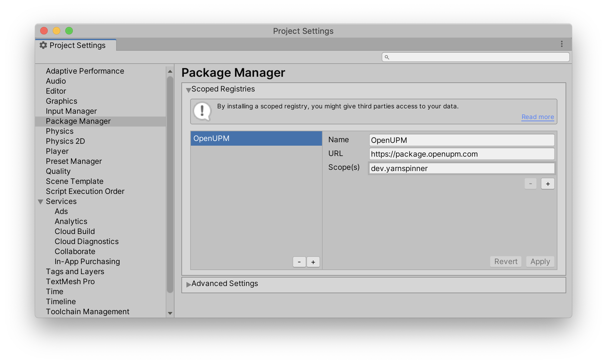
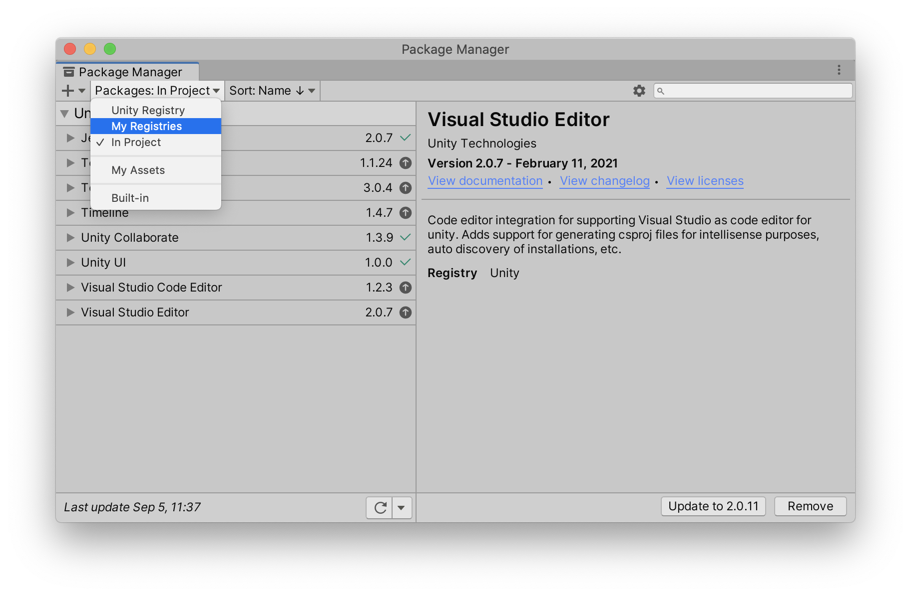
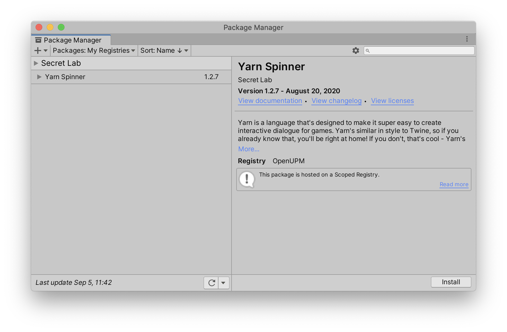
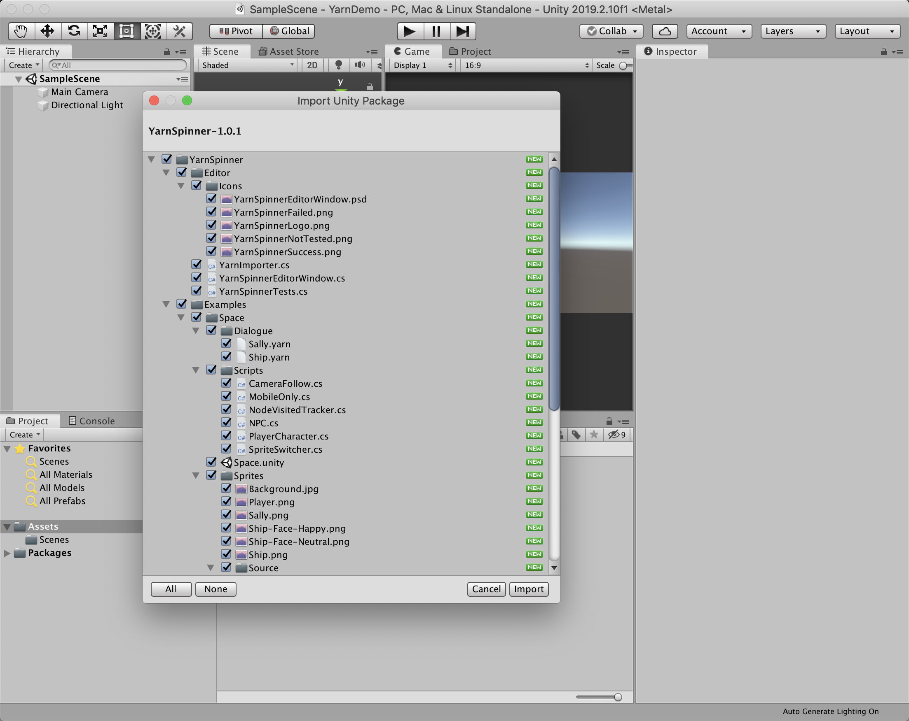

# Installing Yarn Spinner for Unity

There are two ways to install Yarn Spinner for Unity: via the Package Manager, and via a `.unitypackage` file. 


We recommend installing it via the Package Manager, because it's easier to update to new versions of Yarn Spinner as they become available, it doesn't get embedded in the source code of your game, and you have more control over what gets added to your project. 


## Install via the Unity Package Manager (recommended)

You can install the Yarn Spinner package into your project using the Package Manager window in Unity.

Yarn Spinner is available via the [OpenUPM registry](https://openupm.com).  This is the simplest way to install Yarn Spinner, and makes it easy to keep it up to date.


In order to follow the instructions in this section, your project needs to be using Unity 2020.1 or higher. If your project is using an earlier version of Unity, we recommend installing Yarn Spinner from Git.


### Setting Up the OpenUPM Registry in Your Project

Before you can install Yarn Spinner from OpenUPM, you first need to configure your project so that it knows where to get the package from.

1. In Unity, open the Edit menu, and choose Project Settings.
2. In the list of sections at the left hand side of the window, select Package Manager.

This window is where you tell Unity about where to find packages that come from registries besides Unity's built-in one. 

3. In the Name field, type `OpenUPM`.
4. In the URL field, type `https://package.openupm.com`. 
5. In the Scopes field, type `dev.yarnspinner`. 
6. Click Save.

When you're done, the settings window should look like this:



You can now install Yarn Spinner itself.

### Installing the Yarn Spinner package

1. Open the Window menu, and choose Package Manager.
2. In the toolbar, click Packages: In Project, and choose My Registries.



3. Yarn Spinner will appear in the list. Select it, and click Install.



Yarn Spinner will download and install into your project.

You can verify that everything is imported succesfully by looking for Yarn Spinner under Packages, in the Project pane.


## Install from GitHub

As an alternative to downloading Yarn Spinner from OpenUPM, you can install Yarn Spinner by downloading the package directly from GitHub, where the project's source code is stored.


Where possible, we recommend installing Yarn Spinner from OpenUPM rather than GitHub, because it's easier to update to new versions.


To install Yarn Spinner from GitHub, follow these instructions.

#### Unity 2019.3 and later

If you're using Unity 2019.3 or later, you can install the package from GitHub via the Package Manager window:

1. In Unity, open the Window menu, and choose Package Manager.
2. Click the `+` button, and choose "Add package from git URL".


1. In the text field that appears, enter the following URL: **`https://github.com/YarnSpinnerTool/YarnSpinner-Unity.git`**.


Be sure to type the URL exactly as it appears in this document, or the installation won't work.


4. The project will download and install. This might take a moment.

#### Unity 2018.4 to Unity 2019.2

If you're using an earlier version of Unity, you'll need to add the package by updating your project's manifest file:

* Go to the folder that your project is in.
* Open the `Packages` folder.
* Open the file `manifest.json` in your text editor (for example, Visual Studio Code.)
* Update the file to include Yarn Spinner's GitHub URL (don't forget the comma at the end!):

```json {
  "dependencies": {
    "dev.yarnspinner.unity": "https://github.com/YarnSpinnerTool/YarnSpinner-Unity.git",
    "com.unity.2d.sprite": "1.0.0",
    ...
```

* Return to Unity, and Yarn Spinner will download and install.

## Install as a file

If you don't want to install Yarn Spinner as a package, you can download it as a `.unitypackage` file, and extract it into your project. 


This approach works in all versions of Unity. However, because it installs the Yarn Spinner files directly into your project's Assets folder and doesn't do any versioning, updating to a newer version of Yarn Spinner is more complicated. Where possible, we recommend installing Yarn Spinner from OpenUPM or from Git.


To download and install the file, follow these steps:

1. In Unity, open the Window menu, and choose Package Manager.
2. Locate **Text Mesh Pro** in the list, and select it. 
3. Click the Install button to install Text Mesh Pro. This package is required for Yarn Spinner to work.
4. Next, open your browser, and go to the [most recent release](https://github.com/YarnSpinnerTool/YarnSpinner-Unity/releases/latest) of Yarn Spinner for Unity on GitHub.
5. Download the `.unitypackage` for that release.


6. Open the `.unitypackage`. Unity will ask which files you want to add. In almost every case, you'll want to import all files.



7. Click Import.

## Next Steps

Once you've installed Yarn Spinner, you're ready to start using it!


