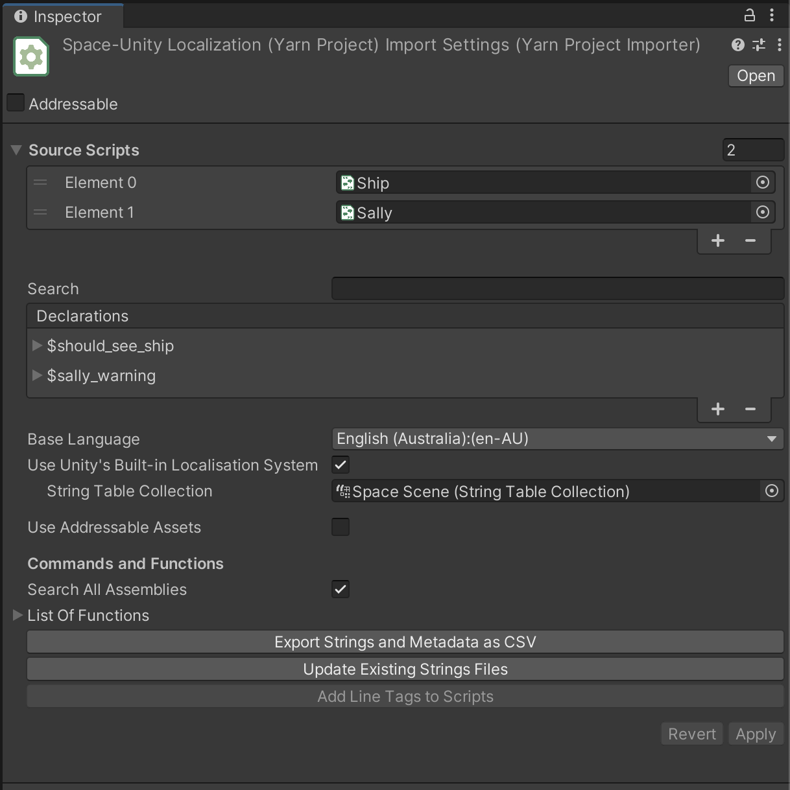

# Yarn Spinner and Unity Localization

Yarn Spinner has its own [internal localisation system](./inbuilt-localisation.md), however there are times when you want to use the Unity Localization package instead, this page will cover how you can do just that, use Yarn Spinner with the Unity Localization package.
Both the Unity Localization and Yarn Spinner localisation approaches are very similar to one another but there are some caveats and extra steps to make them play together.

## Getting Started

Before doing anything with Yarn Spinner you will need to set up your Unity project to use the Unity Localization system.
Unity has some [docs](https://docs.unity3d.com/Packages/com.unity.localization@1.0/manual/index.html) as to this so follow those to ensure that you have:

1. Installed the Unity Localization package
2. Configured the locales for your project
3. Created a string table collection

With these done you should now have your project set up correctly and have a string table collection for your locales with no entries inside.
When using the Unity Localization package we support adding default strings from our yarn files into the string table, adding in the text for other locales is left as an exercise for the reader.

## Importing Default Strings

The Yarn Project can be configured to add the default base language strings from your Yarn files into the string table collection.
To do this you will need to make some changes to the normal Yarn project flow.

1. Create your yarn project
2. Add your Yarn files to the project
3. Set the `Base Language` to your desired language but ensure its one of the locales you enabled in the localization setup
4. Toggle the `Use Unity's Built-in Localization System` to be enabled
5. In the `String Table Collection` field connect up your String Table Collection you made earlier
6. Apply the changes and let the importer perform its magic

If you select and edit the table collection you'll see the lines from your Yarn files have been added into the string table for your Base Language.
The Key of each string will be the `#line` ID from the Yarn files so you can associate them back and forth between your string table and yarn files.

### String Table Import Quirks

When the importer runs through and adds your lines into the string table it uses the Base language field you set in the Yarn Project importer settings to determine *which* locale in your string table collection should have the lines added into.
If you don't have a locale which matches your Base Language we will attempt to find the neutral form of your string table locales and base language and use that to add in the default lines.

This means for example if your string table collection has an English (en) locale and your base language is set to be Australian English (en-au) initially when trying to the lines into the string table it will fail, because English is not Australian English.
But when checking the neutral form of these it will work because they both have the same neutral language of English.

This means you don't have to ensure your string table collection has the *exact* same locale as your base language as long as at least a shared neutral locale is in the table.
The downside to this is at this stage because of how we compare the base language and the string table the *first* locale that matches the shared neutral form will be used, however due to how uncommon supporting multiple specific locales over the neutral locale is we are ok with this.
The upside of this is say you have UK English (en-gb), Australian (en-au) and American (en-us) in your string table with a base language of English (en) you won't know which will get chosen.

## Using the Strings

To use the strings the easiest way is via the new `UnityLocalisedLineProvider` class (catchy name, we know), a subclass of `LineProviderBase` and designed as a Unity Localization system replacement for `TextLineProvider`.
This can be used anywhere a TextLineProvider is already in use.
To configure it all that needs to be done is hook your string table collection up to the `Strings` field of the UnityLocalisedLineProvider.

## Potential Trip-ups and Caveats

Because both Yarn Spinner and Unity use the same marker for their string interpolation and manipulation (`{` and `}`) you can't use the Unity Localization smart strings.

The `UnityLocalisedLineProvider` class at this stage ignores the Text Language Code field when deciding what language to show in favour of using the current locale set by the Unity Localization system.
Our reasoning for this is if you are using the Unity Localization system you want that package to be in charge of deciding what locale is in use.

At this stage despite having support for it we don't use the Unity localization package for asset localisation.
