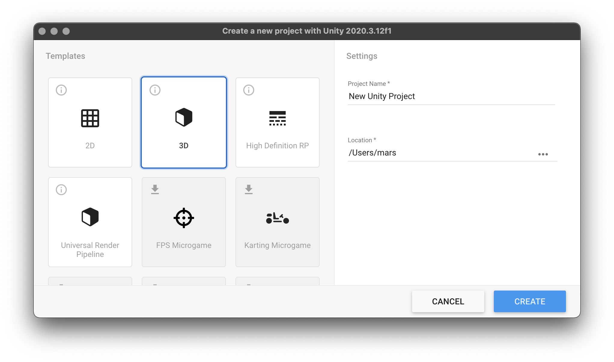
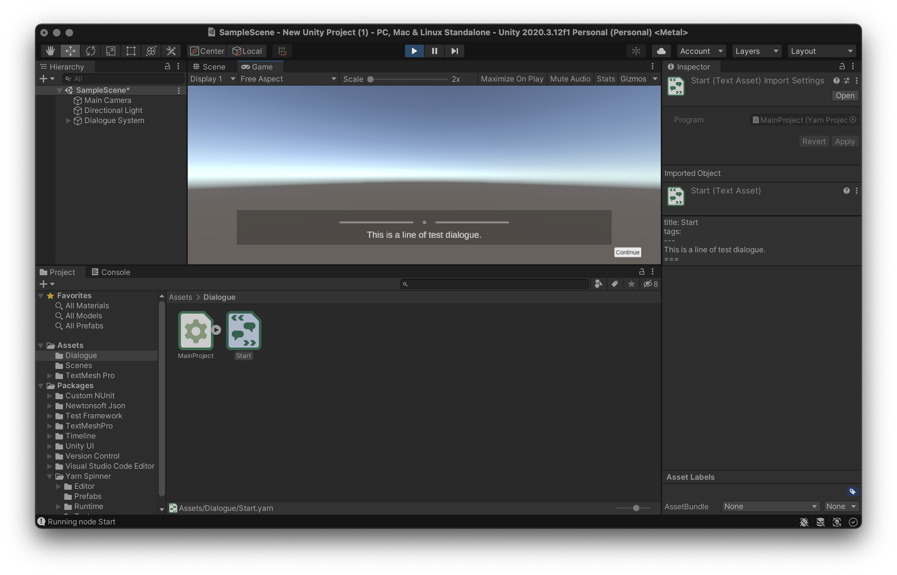
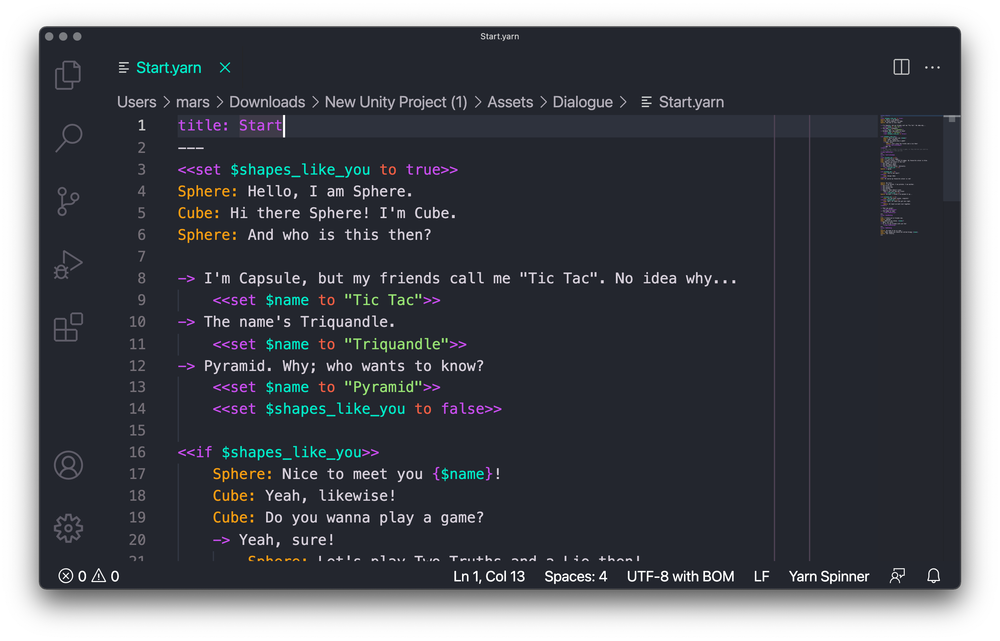
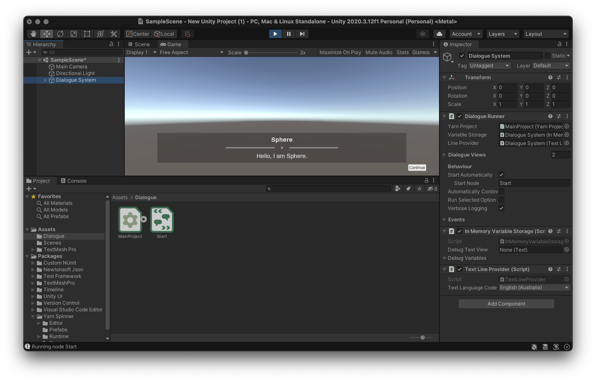
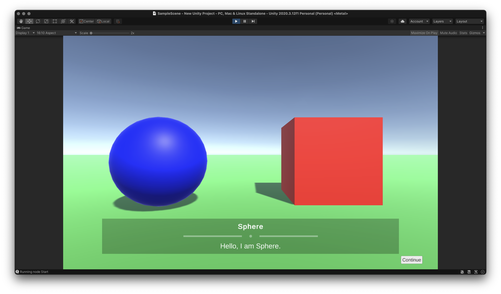

# 📝 Example Project 1

## Goals

1. Display Yarn dialogue in a Unity scene
2. Allow a player to select between options to respond

## Materials

* Yarn Spinner installed in Unity 
* Yarn Spinner set up in a text editor

## Instructions

Open a new Unity 3D project. Ensure Yarn Spinner has been added to the project in the Package Manager as per the [**Installation Instructions**](installation-and-setup.md).



If the sample empty scene is not visible, you'll need to open it. In the **Project Window** where project files are displayed, navigate to **Assets &gt; Scenes** and select **SampleScene.unity**.

Yarn Spinner for Unity comes with a pre-made UI layer and accompanying utility scripts to handle displaying lines and presenting options from Yarn files. In the **Project Window** again, navigate to **Packages &gt; Yarn Spinner &gt; Prefabs** and drag **Dialogue System.prefab** into the scene.


When the **Dialogue System** in the scene is selected, the **Inspector** will display the Yarn Project it is expecting line from. Here, a **Yarn Project** is a kind of linking file that groups Yarn script files together. To make one, navigate to a sensible place for the file to live \(such as a new folder **Assets &gt; Dialogue**\) and right-click the **Project Window** pane to select **Create &gt; Yarn Spinner &gt; Yarn Project**.


The existence of Yarn Projects allows larger games with multiple dialogue systems \(e.g. main story dialogue, barks, storylets\) to separate into multiple projects that pass lines to different UI or systems. This allows an extra level of organisation above separate Yarn files which are typically used to separate story scenes or parts.

However, most games will need only a single Yarn Project.


Select the scene's **Dialogue System** again and drag the new **Yarn Project** into the labelled slot in the Inspector.


Now the Yarn Project needs one or more **Yarn Scripts** to get dialogue from. Just like with the Yarn Project, navigate to the desired file location and select **Create &gt; Yarn Spinner &gt; Yarn Script**. Then, with the Yarn Project selected, drag the newly created script into the Inspector slot labelled **Source Scripts**. Click **Apply**.


By default, a new Yarn Script begins with a single empty node with the name of the file. Open the file, rename the node to **Start** and put a single line of test dialogue. You may remove the `tags` field.

```text
title: Start
---
This is a line of test dialogue.
===
```

Returning to Unity, pressing the ▶️ button results in the test line being displayed in front of the empty scene world. Pressing **Continue** will make the UI disappear, as it has reached the end of the script.



So it's time for the actual writing part. Here, I've opened my new Yarn Script in **Visual Studio Code** with the **Yarn Spinner Extension** installed as per the [**Installation Instructions**](../getting-started/installation-and-setup.md). I've written a simple script about a conversation between a blue sphere 🔵, a red cube 🟥 and the player who plays a shape of their choice. It has some simple branching options that end up with either all the shapes becoming friends, or the player being rude and getting left out.



If you need a refresher on how to represent your story in Yarn, pop back to the [**Syntax and File Structure guide**](../getting-started/yarn-syntax-and-file-structure-1/). Once you've got a basic story, pop back into Unity and check the basics:

* [x] Lines display correctly
* [x] Pressing **Continue** advances lines correctly
* [x] Selecting different options have the expected outcomes



Once any desired visual assets have been added to the scene, the game is complete. 

For mine, I added shapes to the scene by using **Menu &gt; GameObject &gt; 3D Object** to add a Sphere and a Cube for characters, and a Plane to act as a floor. I adjusted their coordinates so that the characters sat on either side of the camera's view, atop the floor. I created basic **Materials** for each in a new Materials folder by right-clicking and selecting **Create &gt; Material**. I changed the **Albedo** on each Material to a different colour, and added the materials to the shapes I created earlier.



This tutorial isn't here to teach you all of Unity. If you need some guidance about aspects outside of Yarn Spinner, you can [**check out our books on the topic**](https://secretlab.games/books) or there are lots of helpful guides around the web, on YouTube, or created by Unity themselves!


## Result

A playable branching story game.



The full script for this final game is as follows.

```text
title: Start
---
<<set $shapes_like_you to true>>
Sphere: Hello, I am Sphere.
Cube: Hi there Sphere! I'm Cube.
Sphere: And who is this then?

-> I'm Capsule, but my friends call me "Tic Tac". No idea why...
    <<set $name to "Tic Tac">>
-> The name's Triquandle.
    <<set $name to "Triquandle">>
-> Pyramid. Why; who wants to know?
    <<set $name to "Pyramid">>
    <<set $shapes_like_you to false>>
    
<<if $shapes_like_you>>
    Sphere: Nice to meet you {$name}!
    Cube: Yeah, likewise!
    Cube: Do you wanna play a game?
    -> Yeah, sure!
        Sphere: Let's play Two Truths and a Lie then!
        <<jump TwoTruthsGame>>
    -> Ugh, no.
<<endif>>
// if they didn't offer to play a game, or they did but you said no,
// then they don't like you now
<<jump BadEnding>>
===
title: TwoTruthsGame
---
<<set $rounds_won to 0>>
Cube: I'll go first! Hmmm...
Cube: I have 6 faces. I have 12 edges. My favourite colour is blue.
Cube: What do you think is the lie?
-> The number of faces.
-> The one about edges.
-> Your favourite colour, obviously.
    <<set $rounds_won += 1>>
Sphere: I agree.

<<if $rounds_won > 0>>
    Cube: You're too smart!
<<else>>
    Cube: Wrong! Haha
<<endif>>
Cube: Of course my favourite colour is red!


Sphere: My turn!
Sphere: I am oblate. I am prolate. I am neither.
-> The first one.
-> The second one.
-> The neither.
-> Hang on, that doesn't work.
    That's two lies and one truth!
    <<set $rounds_won += 1>>
Sphere: Oh wait, I think I've mucked it up...

<<if $rounds_won == 2>>
    Cube: You won both rounds, congrats!
<<elseif $rounds_won == 1>>
    Cube: Well, at least you got one right.
<<else>>
    Sphere: At least we both lost together.
<<endif>>

-> That was great!
    <<jump GoodEnding>>
-> This game is lame.
    <<jump BadEnding>>
===
title: GoodEnding
---
Cube: I think we're friends now.
Sphere: Agreed.
Cube: What do you think, {$name}?
-> BBFs, for sure!
-> As if I'd be friends with you two!
    <<jump BadEnding>>
Sphere: Yay!
THE END
===
title: BadEnding
---
Sphere: No need to be so rude...
Cube: Yeah, maybe you should be called Grumpy {$name}.
Sphere: Ha! Totally.
THE END
===
```

